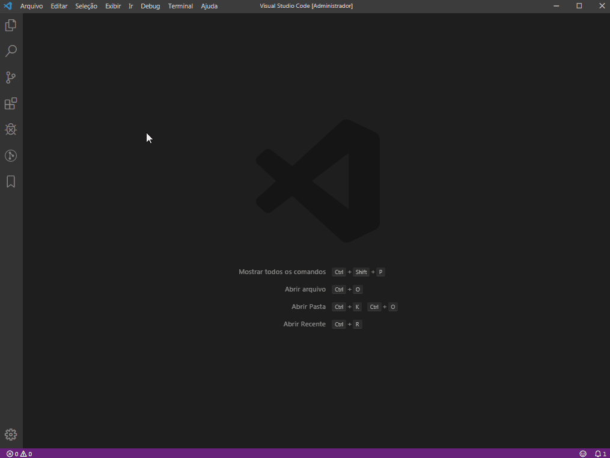
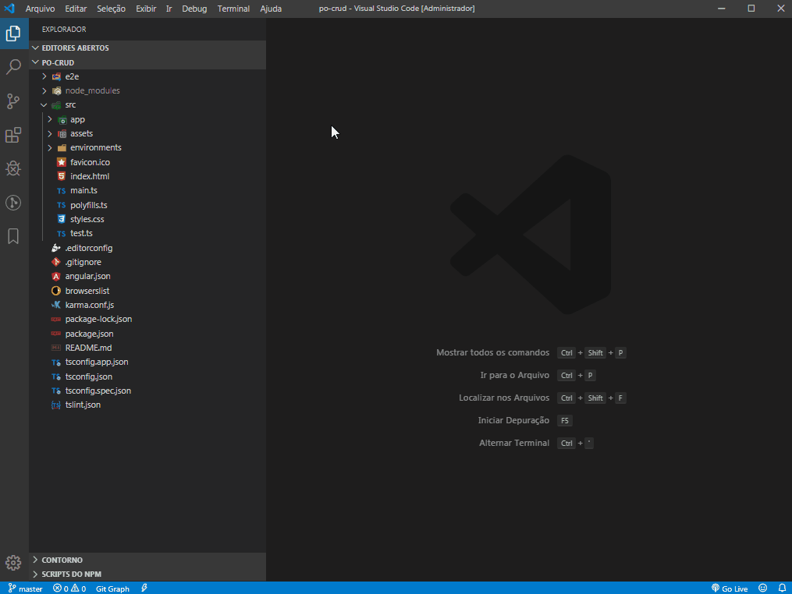
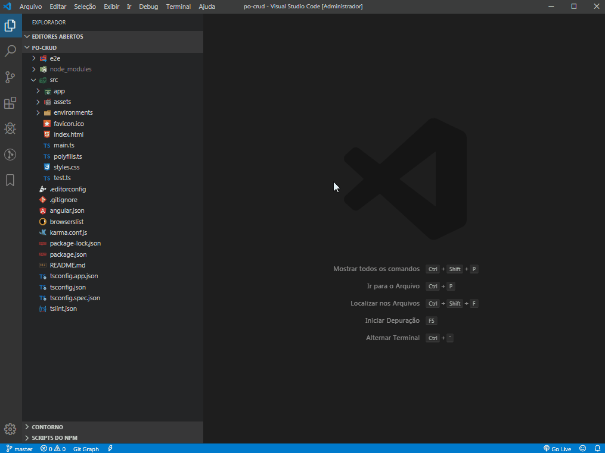

# [Portinari](https://portinari.io/) Gerador de CRUD Simples

Esse extensão cria um CRUD básico com toda a estrutura necessária utilizando o Portinari

## Instalação
Para instalar o Gerador de CRUD:
- Acesse a opção Extensions (Ctrl + Shift + X) no Visual Studio Code
- Pesquise Por Po CRUD
- Instale a extensão



## Utilização
Para utilizar a extensão basta:

**Opção 1:** Clicar com o botão direito sobre a pasta `src` e selecionar a opção `PO: CRUD Simple`.




**Opção 2:**
Abrir o painel de comandos (CTRL + SHIT + P) e digitar PO: CRUD Simple.




## Estrutura das pastas:

```html
- shared
    - literals
        - i18n
            > component-name-pt.ts
            > component-name-en.ts
            > component-name-es.ts
    - model
        > component-name.ts
    - services
        > component-name.service.ts
- component-name
    - edit
        > component-name.edit.component.css
        > component-name.edit.component.html
        > component-name.edit.component.ts
        > component-name.edit.component.spec.ts
    > component-name.list.component.css
    > component-name.list.component.html
    > component-name.list.component.ts
    > component-name.list.component.spec.ts
    > component-name-routing.module.ts
    > component-name.module.ts
```
